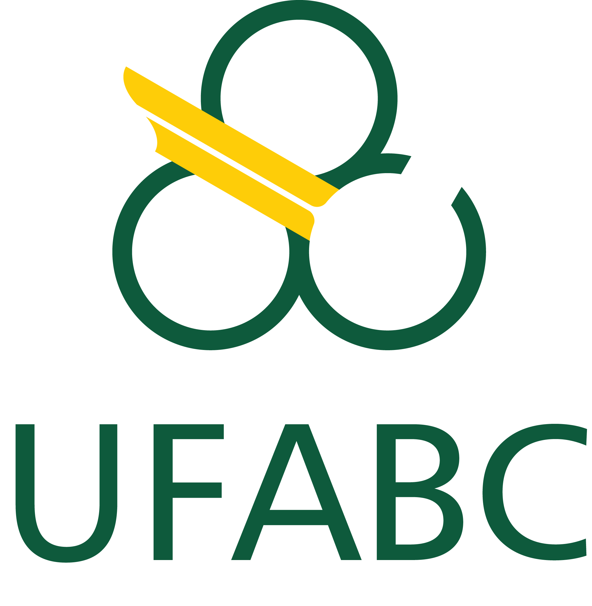

# **REPOSITÓRIO DE ATIVIDADES UFABC**
### Nesse repositório, estão presente algumas atividades de diferentes disciplinas da minha formação na Universidade Federal do ABC (UFABC).
---
### **TURMAS**
### **Quad. 1 de 2026**  
**Processamento da Informação** - Professor: Ronaldo Cristiano Prati \
Envio de atividades via **Moodle**

**Fenômenos Térmicos** - Professor teoria: Pedro Galli Mercadante | Professor pratica: Vilson Tonin Zanchin \
Envio de atividades via **Moodle** e **entrega de relatorios**

### ***TO-DO***
- [ ] Adicionar grade planejada ao repositorio
- [ ] Adicionar calendario ao repositorio 